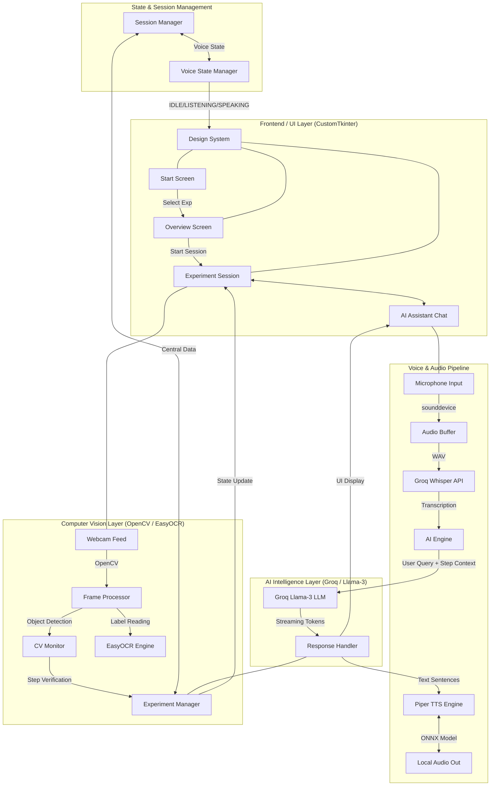

# SENSEBRIDGE SYSTEM ARCHITECTURE & TECH FLOW

This document details the professional technology stack and operational flow of the SenseBridge AI Laboratory Assistant.

---

## 1. High-Level System Flow (Mermaid Diagram)

---

## 2. Technical Stack Details

### A. Frontend & UI Experience
- **Framework**: `CustomTkinter` — used for a modern, high-performance desktop interface that supports high-DPI scaling and custom styling.
- **Styling**: `SenseBridge Monochrome Design System` — a custom-built white-on-black framework with 16-24px rounded corners and geometric typography.
- **Image Processing**: `PIL (Pillow)` — handles the conversion of raw OpenCV camera frames into UI-compatible image objects.

### B. Intelligent Voice Pipeline
1.  **Audio Input**: `sounddevice` library captures 16-bit PCM audio at 16,000Hz.
2.  **Transcription (ASR)**: `Groq Whisper-large-v3` — performs cloud-based transcription with near-zero latency, converting speech to text.
3.  **Synthesis (TTS)**: `Piper TTS` — a local, neural-based voice synthesis engine using ONNX models for fast, human-like speech output.

### C. AI Guidance & LLM
- **Engine**: `Groq Cloud` hosting `Meta Llama-3-70b`.
- **Instruction Set**: Managed via `core/ai_engine.py`. Every request is appended with the experiment's current procedure, safety rules, and material list.
- **Streaming**: Implements a sentence-based streaming queue to allow the voice assistant to start speaking while the LLM is still finishing its response.

### D. Computer Vision (CV) Systems
- **Core Engine**: `OpenCV (cv2)` — manages the webcam hardware and basic frame manipulation.
- **Monitoring**: `core/cv_monitor.py` — runs a dedicated background loop to process frames without blocking the UI thread.
- **EasyOCR**: A deep-learning-based OCR engine used to verify the text on chemical containers and equipment labels.
- **Object Detection**: Simple color-based or feature-based detection algorithms to track beakers and liquid levels.

### E. State & Logic Management
- **SessionManager**: The "Single Source of Truth" that keeps track of which experiment is running and if the session is paused.
- **VoiceStateManager**: A state machine that transitions between `IDLE`, `LISTENING`, `PROCESSING`, and `SPEAKING` to coordinate audio hardware.
- **ExperimentManager**: Parses `.json` files into a step-by-step logic tree for the AI and CV systems to follow.

---

## 3. Operational Logic Flow
1. **User Input**: User taps the microphone or card on the UI.
2. **Context Assembly**: The system grabs the current experiment step and safety metadata.
3. **AI Processing**: The LLM processes the input and returns a response.
4. **Action Execution**: If the AI detects a "Complete" signal from the CV system or a "Restart" request from the user, the `ExperimentManager` updates the state.
5. **Feedback**: The response is spoken via Piper TTS and displayed in the Chat Bubble.
